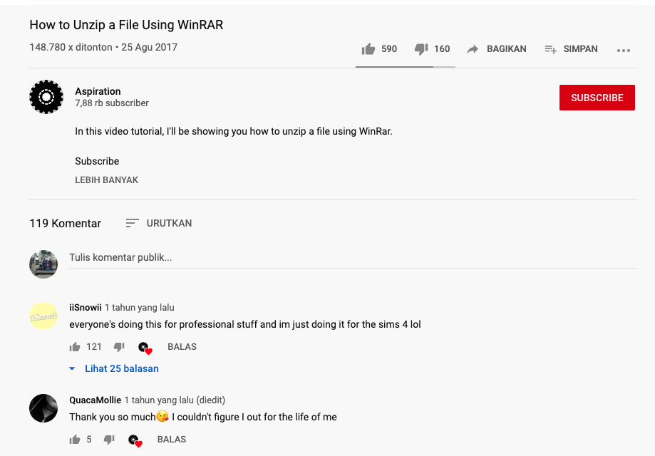

Selamat datang kembali di blog saya. Akhirnya setelah sekian lama
akhirnya menerbitkan tulisan pertama di tahun 2020. Kali ini kita akan
membahas tips bagaimana menjadi pembicara di acara konferensi maupun
di media lainnya. Sebelum menjadi pembicara, hal yang pertama kita
lakukan adalah <b>menentukan topik apa</b> yang akan dibawa. Banyak
yang berpikiran bahwa <b>"I have nothing to say, it's all been
covered"</b>, artinya bahwa tidak ada bahan topik yang bisa dibawakan,
karena orang-orang lain sudah memahami bahkan memiliki kemampuan
diatas diri sendiri.

Hal tersebut yang menghalangi diri sendiri untuk bisa menjadi
pembicara dimanapun itu. Padahal kenyataannya adalah tidak semua orang
di dunia ini memahami semua hal yang ada, bahkan tidak mengetahui sama
sekali tentang perkembangan yang ada.

Gambar diatas menunjukkan bahkan hanya untuk sekedar melakukan
<b>unzip</b> dengan winRAR ditonton sebanyak 148.780 kali. Hal ini
menunjukkan bahwa kesempatan kalian untuk berbicara dimanapun dengan
topik tertentu sangat terbuka lebar, tentunya dengan persiapan yang
baik dan matang pula. Terdapat 6 tips dalam memilih topik yang akan
dibawakan, yaitu :

- <b>Bring Pen and Paper Everyday</b> => Ide selalu datang dimana saja
  dan kapan saja, dengan selalu membawa kedua alat tersebut, bisa
  mencatat setiap ide yang didapat lalu menjabarkannya, karena ide
  tidak akan selalu datang dua kali.
- <b>Motivation</b> => Ini yang paling utama, apa motivasi yang kalian
  inginkan ketika akan menyampaikan topik tersebut. Apakah ingin
  terkenal, ingin berbagi, atau ada motivasi lainnya? Ini perlu
  ditentukan agar kalian dapat menemukan semangat dalam menggali topik
  tersebut.
- <b>What you or your team have done?</b> => Punya pengalaman pribadi
  atau dengan tim? Apa saja yang sudah dilakukan atau diselesaikan?
  Ini juga penting untuk memperkaya konten topik serta sudut pandang
  kalian dalam menyajikan topik tersebut. Walaupun hanya konsep dasar
  tapi bila berasal dari berbagai perspektif akan membuat topik kalian
  semakin disenangi tentunya.
- <b>AHA!Moment</b> => Ketika kalian mengerjakan sesuatu hal yang
  rumit dan saat itu menemukan solusinya, dan it works? Itulah AHA!
  moment. Ini bisa menjadi konten topik yang sangat bagus karena
  memiliki masalah dan menemukan solusi yang dapat menyelesaikan
  permasalahan tersebut. Karena besar kemungkinan masalah tersebut
  ditemukan oleh orang lain dan belum menemukan solusinya.
- <b>What do you want to learn?</b> => Disatu sisi krusial tapi di
  sisi lainnya sangat bagus untuk memacu semangat eksplorasi kalian.
  Apa yang kalian ingin pelajari bisa menjadi bahan untuk topik yang
  akan kalian bawakan. Jika diterima, tentunya ini sebagai motivasi
  besar untuk melakukan eksplorasi terhadap topik tersebut. Tidak
  mungkin dong kalian tampil di depan banyak orang membawakan topik
  yang kalian sendiri belum kuasai dengan baik.
- <b>Passion</b> => Last but not least, passion menjadi kunci untuk
  menyajikan topik tersebut. Dari 5 hal diatas yang sudah kita lewati,
  tentukan hal-hal apa yang sesuai dengan passion kalian untuk
  dijadikan sebagai topik. Karena semakin sesuai dengan passion
  kalian, tentunya proses belajar dan eksplorasi tidak akan menjadi
  beban buat kalian, justru menjadi bersemangat dan terpacu untuk
  menyajikan topik yang berbobot dan baik untuk ditampilkan.

6 hal diatas merupakan tips langkah-langkah yang bisa kalian lakukan
untuk menentukan topik apa yang akan kalian bawakan. Dan ingat untuk
jangan pernah berpikir bahwa apa yang kalian pikirkan atau bawakan
tersebut sudah dikuasai oleh orang lain. Masih banyak orang-orang yang
belum memahami hal-hal tersebut dan dengan datangnya kalian, mampu
menyelesaikan permasalahan yang mereka hadapi.

Well, selamat membaca dan mencoba ya. Jangan lupa di share ke yang
lainnya yah. Terima kasih.
